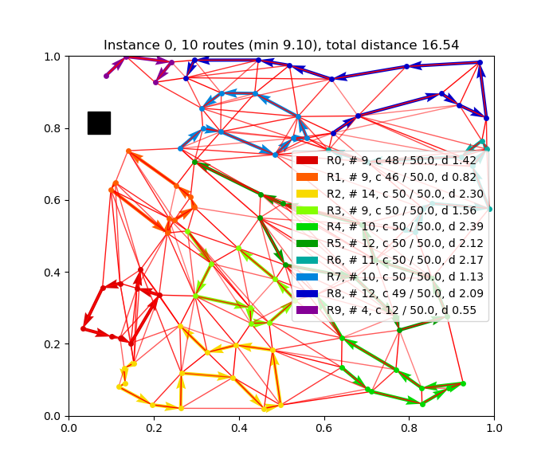
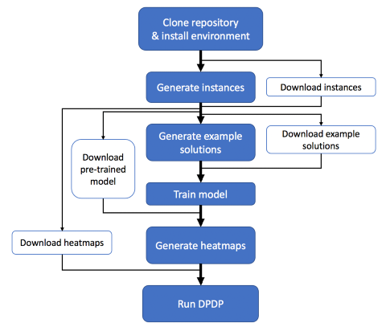

# Deep Policy Dynamic Programming for Vehicle Routing Problems
This repository contains code for [Deep Policy Dynamic Programming](https://arxiv.org/abs/2102.11756) by Wouter Kool, Herke van Hoof, Joaquim Gromicho and Max Welling.




## Table of contents
- [Overview](#overview)
- [Install environment](#install-environment)
- [Generate instances](#generate-instances-or-download) (or [download instances](#download-instances))
- [Generate example solutions](#generate-example-solutions-or-download) (or [download example solutions](#download-example-solutions))
- [Train model](#train-model) (or [download pretrained models](#download-pretrained-models))
- [Generate heatmaps](#generate-heatmaps) (or [download heatmaps](#download-heatmaps))
- [Running Deep Policy Dynamic Programming](#running-deep-policy-dynamic-programming)
- [Reproducing results from the paper](#reproducing-results-from-the-paper)
- [Visualizing solutions](#visualizing-solutions)

### Overview
See below for the full training and testing pipeline, including shortcuts. The shortest path to results is to generate/download (test-)instances, download heatmaps and run DPDP. All data related to this repository can be found [here](https://drive.google.com/drive/folders/18Z-FLvLVZmot19nXHViLeZiCZm1Qu27v?usp=sharing). For TSP, we only provide instructions using the pre-trained model or downloading the heatmaps directly. For data/instructions for training the TSP model we refer to [graph-convnet-tsp](https://github.com/chaitjo/graph-convnet-tsp).



## Install environment
It is recommended to use [Anaconda](https://www.anaconda.com/) and install [PyTorch](https://pytorch.org/get-started/locally/) with the right cudatoolkit and install [CuPy](https://docs.cupy.dev/en/stable/install.html#installing-cupy-from-conda-forge) and [PyTorch scatter](https://github.com/rusty1s/pytorch_scatter) with the same cuda toolkit versions:
```bash
# Create environment named 'dpdp' and activate
conda create -n dpdp python=3.8 scipy anaconda -y
conda activate dpdp
# Install some basic packages
conda install tqdm -y
pip install gdown
# Install PyTorch, see https://pytorch.org/get-started/locally/
conda install pytorch torchvision torchaudio cudatoolkit=10.2 -c pytorch -y
# If you want to train models, you need these packages
pip install tensorboardx==1.5 fastprogress==0.1.18
# We use cupy for some efficient operations
# Somehow conda installation fails
# conda install -c conda-forge cupy cudatoolkit=10.2 -y
pip install cupy-cuda102
# Also some efficient sparse operations using https://github.com/rusty1s/pytorch_scatter
pip install torch-scatter -f https://pytorch-geometric.com/whl/torch-1.8.0+cu102.html
```

## Generate instances (or download)
Preferably generate instances as files are large but easy to generate, this may take a few minutes for 1 million training instances, but validation/test instances should be seconds.
For TSP, we don't generate training instances as we used the pre-trained model from [graph-convnet-tsp](https://github.com/chaitjo/graph-convnet-tsp).
```bash
# Generate validation and test data for tsp and vrp
python generate_data.py --problem all --name validation --seed 4321
# Note, due to some subtle differences it is recommended to download the test data rather than generate (see below)
# python generate_data.py --problem all --name test --seed 1234
# Note: training data only needed if you want to train a model yourself (here only vrp)
python generate_data.py --problem vrp --name train --seed 42 --dataset_size 1000000 # May take some minutes, feel free to optimize!
```

### Download instances
If generating instances fails, you can download the datasets from the folder *data* in [here](https://drive.google.com/drive/folders/18Z-FLvLVZmot19nXHViLeZiCZm1Qu27v?usp=sharing). The files should be saved as `data/{tsp|vrp}/{dataset_name}.pkl`. This can be done using the below commands.

```bash
pip install gdown

mkdir -p data/tsp
cd data/tsp

# Download tsp datasets (22mb each)
gdown --id 1tlcHok1JhOtQZOIshoGtyM5P9dZfnYbZ # tsp100_validation_seed4321.pkl
gdown --id 1woyNI8CoDJ8hyFko4NBJ6HdF4UQA0S77 # tsp100_test_seed1234.pkl

cd ../..

mkdir -p data/vrp
cd data/vrp

# Download nazari datasets (25mb, 25mb and 2.5 GB)
gdown --id 1FRzrf720xG-POPU220_Y_jfRoV9vpz8P # vrp_nazari100_validation_seed4321.pkl
gdown --id 1G5K4b1PzUdxjVmqxRXpamkbHolsxi8jv # vrp_nazari100_test_seed1234.pkl
gdown --id 1YzBRUIuuCTVzm2VbLUi7D2XquSO2ihd9 # vrp_nazari100_train_seed42.pkl

# Download uchoa datasets (25mb, 25mb and 2.5 GB)
gdown --id 1e6cUGCD5_iC3OQTA6NM38UDFEaKWsGGt # vrp_uchoa100_validation_seed4321.pkl
gdown --id 1Se_x7gfkeVNq-crGTCsOCtda97XiEwJr # vrp_uchoa100_test_seed1234.pkl
gdown --id 16nYaVr3cloxpVBeb3ueXYtnpdeCZCMkj # vrp_uchoa100_train_seed42.pkl

cd ../..
```

## Generate example solutions (or download)
*Note: this step can be skipped if you download a pre-trained model or heatmaps directly. If you only want to train a model, it is recommended to download example solutions (see below) as generating them takes very long (multiple weeks on a single machine for 1 million instances). These steps are included for full reproducibility or if you want to generate solutions for your own dataset.*

To generate solutions for VRP using [LKH3](http://akira.ruc.dk/~keld/research/LKH-3/) for the validation/test sets, use the below commands. This will download and compile LKH automatically and use multiprocessing to run on all available CPUs in parallel (this can be disabled by adding `--cpus=1`).
```bash
python -m problems.vrp.vrp_baseline lkh data/vrp/vrp_nazari100_validation_seed4321.pkl -f
python -m problems.vrp.vrp_baseline lkh data/vrp/vrp_nazari100_test_seed1234.pkl -f
```
As the training set is very large (1 million instances), it is recommended to download example solutions as described below. If you really want to generate training data yourself, it may be desired to divide the computation in separate commands (which can be run on separate machines), e.g. in 100 batches of 10K instances. For the Uchoa et al. dataset we used 250K instances. Since results are cached, a single file with the results can then quickly be generated after all commands have finished.
```bash
# These commands can be run in parallel on different machines
for i in {0..99}; do python -m python -m problems.vrp.vrp_baseline lkh data/vrp/vrp_nazari100_train_seed42.pkl -n 10000 --offset ${i}0000 -f; done
for i in {0..99}; do python -m python -m problems.vrp.vrp_baseline lkh data/vrp/vrp_uchoa100_train_seed42.pkl -n 10000 --offset ${i}0000 -f; done
# Run this after all above commands have finished! Generate solutions using cache (--only_cache to not retry failed instances)
python -m python -m problems.vrp.vrp_baseline lkh data/vrp/vrp_nazari100_train_seed42.pkl -f --only_cache
python -m python -m problems.vrp.vrp_baseline lkh data/vrp/vrp_uchoa100_train_seed42.pkl -n 250000 -f --only_cache
```


### Download example solutions
Example solutions can be downloaded from the folder *results* in [here](https://drive.google.com/drive/folders/18Z-FLvLVZmot19nXHViLeZiCZm1Qu27v?usp=sharing) and should be saved in results/vrp/{dataset_name}/{filename}.pkl, which can be achieved using below commands.
```bash
pip install gdown

mkdir -p results/vrp
cd results/vrp

# Download nazari example solutions (250mb, 2.5mb and 2.5mb)
mkdir -p vrp_nazari100_train_seed42 && gdown --id 1shWepqKxnCK1-xOWnkmj9T2iNHOP_lqg --output vrp_nazari100_train_seed42/vrp_nazari100_train_seed42-lkh.pkl
mkdir -p vrp_nazari100_validation_seed4321 && gdown --id 165bRSHpYGg9COILPDQEA1G_onpVDLaGl --output vrp_nazari100_validation_seed4321/vrp_nazari100_validation_seed4321-lkh.pkl
mkdir -p vrp_nazari100_test_seed1234 && gdown --id 1L_LFimzvKwOewva7KfDvh08sVhkcHXFW --output vrp_nazari100_test_seed1234/vrp_nazari100_test_seed1234-lkh.pkl

# Download uchoa example solutions (65mb, 2.5mb and 2.5mb)
mkdir -p vrp_uchoa100_train_seed42 && gdown --id 1HjBIX-eh6cY0f2hpEry6tnUh1GnTQMe8 --output vrp_uchoa100_train_seed42/vrp_uchoa100_train_seed42n250000-lkh.pkl
mkdir -p vrp_uchoa100_validation_seed4321 && gdown --id 1JdcrWcYKMWdvs-oud7juc3zeJpPcJkj3 --output vrp_uchoa100_validation_seed4321/vrp_uchoa100_validation_seed4321-lkh.pkl
mkdir -p vrp_uchoa100_test_seed1234 && gdown --id 1sMyxYOQhJ3uI2bIY09EisjvLz0lLBfX- --output vrp_uchoa100_test_seed1234/vrp_uchoa100_test_seed1234-lkh.pkl

# LKHU result for failed instance 6216 of validation set and 5099 and 9795 of test set
gdown --id 1sHIeO2J4z04q-tG1TzV87LxlLEZTSv0B --output vrp_uchoa100_validation_seed4321/vrp_uchoa100_validation_seed4321offs6216n1-lkhu.pkl
gdown --id 1DvbubTuTBisvGdRO2wjNy5W3tl7CfefL --output vrp_uchoa100_test_seed1234/vrp_uchoa100_test_seed1234offs5099n1-lkhu.pkl
gdown --id 18YKCss2AI8Bd-sZA9AzN8UlrTcNeuOG0 --output vrp_uchoa100_test_seed1234/vrp_uchoa100_test_seed1234offs9795n1-lkhu.pkl

cd ../..
```

### Visualize example solutions
You can inspect if everything went well by visualizing the example solutions:
```bash
python visualize.py --problem vrp --instances data/vrp/vrp_nazari100_validation_seed4321.pkl \
 --solutions results/vrp/vrp_nazari100_validation_seed4321/vrp_nazari100_validation_seed4321-lkh.pkl
```

## Train model

To train the model for TSP, see [graph-convnet-tsp](https://github.com/chaitjo/graph-convnet-tsp). For VRP, use the commands below:
```bash
python main_vrp.py --config configs/vrp_nazari100.json
python main_vrp.py --config configs/vrp_uchoa100.json
```
By default this will run on all GPUs. To run on specific GPUs, use
```bash
CUDA_VISIBLE_DEVICES=0,1 python main_vrp.py ...
```
With +-10GB of memory (1080Ti) you can run a batch size of 6 per GPU. A batch size of 48 takes about 80GB of memory (fits, e.g. 4x TitanRTX). If you get out-of-memory errors there are a number of options: 
* Run on more/larger GPUs. :)
* Alternatively, reduce the value for `batch_size` (default 48) in the config, which will reduce performance (optionally this can be compensated for by longer training and appropriately tuning the learning rate).
* Change the model architecture, e.g. reduce the number of layers or hidden units. This will most likely decrease performance which cannot be compensated for by longer training.
* Download a pre-trained model below.
* NOT WORKING: Add `'num_segments_checkpoint': {num}`, to use memory [checkpoints](https://pytorch.org/docs/stable/checkpoint.html) between the 30 (default) layers (e.g. try 3, 5, 6, or 10). Currently, there seems to be a bug with the gradients as results are much worse. Feel free to investigate!

### Download pretrained models

```bash
pip install gdown

# Download TSP pretrained models from https://github.com/chaitjo/graph-convnet-tsp
mkdir -p logs
cd logs
gdown --id 1qmk1_5a8XT_hrOV_i3uHM9tMVnZBFEAF
tar -xvzf old-tsp-models.tar.gz
mv tsp-models/* .
rm -rf tsp-models
rm old-tsp-models.tar.gz
cd ..

# Download VRP pretrained models (133 mb each)
cd logs

mkdir -p vrp_nazari100
gdown --id 18PJQqtWjN-NALRe-241HnrGbSZtm8Il5 --output vrp_nazari100/config.json
gdown --id 1bRk_bNZGsgoIN1IPvleWRcvKlDsAB6Pp --output vrp_nazari100/best_val_loss_checkpoint.tar

mkdir -p vrp_uchoa100
gdown --id 1P4eBv_hqJKJREw81XIYqaRx-tkKZzimu --output vrp_uchoa100/config.json
gdown --id 10qef1QUu3JHHg5o64eSBjtDK3eqn1zrS --output vrp_uchoa100/best_val_loss_checkpoint.tar

cd ..
```

## Generate heatmaps
To generate heatmaps, use the following commands:
```bash
# Validation set
python export_heatmap.py --problem tsp --checkpoint logs/tsp100/best_val_checkpoint.tar --instances data/tsp/tsp100_validation_seed4321.pkl -f --batch_size 50 --no_prepwrap
python export_heatmap.py --problem vrp --checkpoint logs/vrp_nazari100/best_val_loss_checkpoint.tar --instances data/vrp/vrp_nazari100_validation_seed4321.pkl -f --batch_size 50
python export_heatmap.py --problem vrp --checkpoint logs/vrp_uchoa100/best_val_loss_checkpoint.tar --instances data/vrp/vrp_uchoa100_validation_seed4321.pkl -f --batch_size 50

# Test set
python export_heatmap.py --problem tsp --checkpoint logs/tsp100/best_val_checkpoint.tar --instances data/tsp/tsp100_test_seed1234.pkl -f --batch_size 50 --no_prepwrap
python export_heatmap.py --problem vrp --checkpoint logs/vrp_nazari100/best_val_loss_checkpoint.tar --instances data/vrp/vrp_nazari100_test_seed1234.pkl -f --batch_size 50
python export_heatmap.py --problem vrp --checkpoint logs/vrp_uchoa100/best_val_loss_checkpoint.tar --instances data/vrp/vrp_uchoa100_test_seed1234.pkl -f --batch_size 50
```
By default this will run on all GPUs. To run on specific GPUs, use
```bash
CUDA_VISIBLE_DEVICES=0,1 python export_heatmap.py ...
```
### Download heatmaps
The heatmaps can also be downloaded for the validation and test sets.
```bash
pip install gdown

mkdir -p results/tsp
cd results/tsp

# Download TSP heatmaps (400mb each)
mkdir -p tsp100_validation_seed4321/heatmaps && gdown --id 14sc6E1OdOBB8ZuCpaWltdBpdD8-g8XYK --output tsp100_validation_seed4321/heatmaps/heatmaps_tsp100.pkl
mkdir -p tsp100_test_seed1234/heatmaps && gdown --id 1fSU39SzUoNlSUJo7qOqe7eL45Wak00vH --output tsp100_test_seed1234/heatmaps/heatmaps_tsp100.pkl

cd ../..

mkdir -p results/vrp
cd results/vrp

# Download vrp nazari heatmaps (410mb each)
mkdir -p vrp_nazari100_validation_seed4321/heatmaps && gdown --id 1qyT01Hdm7o_HQfS8ptnoFR7xLbPJaONS --output vrp_nazari100_validation_seed4321/heatmaps/heatmaps_vrp_nazari100.pkl
mkdir -p vrp_nazari100_test_seed1234/heatmaps && gdown --id 1lXTI3gBH2FWakjA-NL1p0o4CbFOScXPZ --output vrp_nazari100_test_seed1234/heatmaps/heatmaps_vrp_nazari100.pkl

# Download vrp uchoa heatmaps (410mb each)
mkdir -p vrp_uchoa100_validation_seed4321/heatmaps && gdown --id 1SqaWma8Vt1LTukT-H2JV4VChP__FnxSu --output vrp_uchoa100_validation_seed4321/heatmaps/heatmaps_vrp_uchoa100.pkl
mkdir -p vrp_uchoa100_test_seed1234/heatmaps && gdown --id 1KIkK3xhHDI7tgHg9U7oEZ4EldKvWDZxG --output vrp_uchoa100_test_seed1234/heatmaps/heatmaps_vrp_uchoa100.pkl

cd ../..
```

## Running Deep Policy Dynamic Programming
To run DPDP, use for example the following commands.
```bash
# TSP
python eval.py data/tsp/tsp100_validation_seed4321.pkl --problem tsp --decode_strategy dpdp --score_function heatmap_potential --beam_size 100000 --heatmap_threshold 1e-5 --heatmap results/tsp/tsp100_validation_seed4321/heatmaps/heatmaps_tsp100.pkl
# VRP
python eval.py data/vrp/vrp_nazari100_validation_seed4321.pkl --problem cvrp --decode_strategy dpdp --score_function heatmap_potential --beam_size 100000 --heatmap_threshold 1e-5 --heatmap results/vrp/vrp_nazari100_validation_seed4321/heatmaps/heatmaps_vrp_nazari100.pkl
# VRP Uchoa dataset
python eval.py data/vrp/vrp_uchoa100_validation_seed4321.pkl --problem cvrp --decode_strategy dpdp --score_function heatmap_potential --beam_size 100000 --heatmap_threshold 1e-5 --heatmap results/vrp/vrp_uchoa100_validation_seed4321/heatmaps/heatmaps_vrp_uchoa100.pkl
```
For all options that can be used with `eval.py`, use `python eval.py --help`.

### Multiple GPUs
By default, DPDP will use *all available GPUs*, using multiprocessing to run one process per GPU.
To run with a specific set of GPUs, use
```bash
CUDA_VISIBLE_DEVICES=0,1 python eval.py ...
```
It is recommended to use `--num_processes` to use (at least) 2 processes per GPU to maximize efficiency (see below).
When using 1 process per device and a single device (CPU or GPU), DPDP will not use multiprocessing.
To disable GPUs at all and force use of the CPU, use `--no_cuda` (or prepend `CUDA_VISIBLE_DEVICES=''`).

### Maximizing runtime efficiency
To maximize efficiency for small beam sizes (<25.000), you should use `--batch_size` with a large batch size > 1. As the batched implementation is slightly different and less efficient, for larger beam sizes (>= 25.000) you should use a batch size of 1 with preferably 2 - 5 processes per GPU to fully utilize the GPU (e.g. `--num_processes 2`). See also `experiments/beam_sizes.sh`.

### Running on a cluster
To produce results on a cluster, you can split the dataset into separate commands, for example 10 x 1.000 instances, after which you can merge the results into a single file:
```bash
# These commands can be run in parallel on different machines
for i in {0..9}; do python eval.py data/vrp/vrp_nazari100_validation_seed4321.pkl --val_size 1000 --offset ${i}000 -o results/vrp/vrp_nazari100_validation_seed4321/dpdp100Koffs${i}000n1000.pkl --problem cvrp --decode_strategy dpdp --score_function heatmap_potential --beam_size 100000 --heatmap_threshold 1e-5 --heatmap results/vrp/vrp_nazari100_validation_seed4321/heatmaps/heatmaps_vrp_nazari100.pkl; done
# Run this after all above commands have finished to generate single result file!
python merge_results.py results/vrp/vrp_nazari100_validation_seed4321/dpdp100Koffs*.pkl -o results/vrp/vrp_nazari100_validation_seed4321/dpdp100K.pkl
```

## Reproducing results from the paper

All data used to report results in the paper can also be downloaded from the folder *results* in [here](https://drive.google.com/drive/folders/18Z-FLvLVZmot19nXHViLeZiCZm1Qu27v?usp=sharing). After generating or downloading the results, the tables and figures can be reproduced using [plot_results.ipynb](plot_results.ipynb).

*Note: this code was simplified for usability, and a batched implementation has been added. As a result, runtimes for small beam sizes are (significantly) faster than reported in the paper, while runtimes for large beam sizes are slightly less efficient than reported in the paper (around 10%). The results may slightly vary.*

### Main results

#### Travelling Salesman Problem ([download](https://drive.google.com/drive/folders/1z8lHBBYSMH3AbuLQCPKI-81tS8Sl2yRS?usp=sharing))
```bash
experiments/main_results.sh tsp tsp/tsp100_test_seed1234 heatmaps_tsp100
```

#### Vehicle Routing Problem ([download](https://drive.google.com/drive/folders/1D0TTK3OCsFpJLi3KxZfpGdH1X7Ihr7Nc?usp=sharing))
```bash
experiments/main_results.sh cvrp vrp/vrp_nazari100_test_seed1234 heatmaps_vrp_nazari100
```

#### Vehicle Routing Problem, (Uchoa dataset, [download](https://drive.google.com/drive/folders/1yr5vjzwo-zPYAwT9WvxBCthp1yPsIwWK?usp=sharing))
```bash
experiments/main_results.sh cvrp vrp/vrp_uchoa100_test_seed1234 heatmaps_vrp_uchoa100
```

#### TSP with Time Windows (TSPTW)
The datasets, heatmaps and pretrained models for TSPTW can all be found [here](https://drive.google.com/drive/folders/18Z-FLvLVZmot19nXHViLeZiCZm1Qu27v?usp=sharing). After downloading the training data, you can use the following commands for the da Silva et al. dataset:

```bash
python main_tsp.py --config configs/tsptwds100_dir.json
python export_heatmap.py --problem tsptw --checkpoint logs/tsptwds100_dir/best_val_loss_checkpoint.tar --instances data/tsptw/tsptw_da_silva100_test_seed1234.pkl -f --batch_size 50
python eval.py data/tsptw/tsptw_da_silva100_test_seed1234.pkl --problem tsptw --decode_strategy dpdp --score_function heatmap_potential --beam_size 100000 --heatmap_threshold 1e-5 --heatmap results/tsptw/tsptw_da_silva100_test_seed1234/heatmaps/heatmaps_tsptwds100_dir.pkl
```


### Ablations ([download](https://drive.google.com/drive/folders/1N_MMmHnUF4AXFYN1hpj8K9HV1IHot6ey?usp=sharing))

#### Scoring policy
```bash
experiments/score_function.sh cvrp vrp/vrp_nazari100_validation_seed4321 heatmaps_vrp_nazari100
```

#### Beam size
```bash
experiments/beam_sizes.sh cvrp vrp/vrp_nazari100_validation_seed4321 heatmaps_vrp_nazari100
```

#### Graph sparsity (adjacency)
```bash
experiments/adjacency.sh cvrp vrp/vrp_nazari100_validation_seed4321 heatmaps_vrp_nazari100
```

## Visualizing solutions
Use the following command to visualize solutions:
```bash
python visualize.py --problem vrp --instances data/vrp/vrp_nazari100_validation_seed4321.pkl \
 --solutions results/vrp/vrp_nazari100_validation_seed4321/beam_size_experiment/beam1000000.pkl \
  --heatmaps results/vrp/vrp_nazari100_validation_seed4321/heatmaps/heatmaps_vrp_nazari100.pkl \
  --heatmap_no_depot --heatmap_threshold 0.5
```


## Acknowledgements
This repository was built upon the excellent repository [graph-convnet-tsp](https://github.com/chaitjo/graph-convnet-tsp) by Chaitanya K. Joshi and my own repository [attention-learn-to-route](https://github.com/wouterkool/attention-learn-to-route). The TSPTW GVNS code is from the repository [TSPTW](https://github.com/sashakh/TSPTW), adapted from [the original code](http://homepages.dcc.ufmg.br/~rfsilva/tsptw/) of da Silva et al. We thank Quentin Cappart for kindly providing TSPTW instances and results.